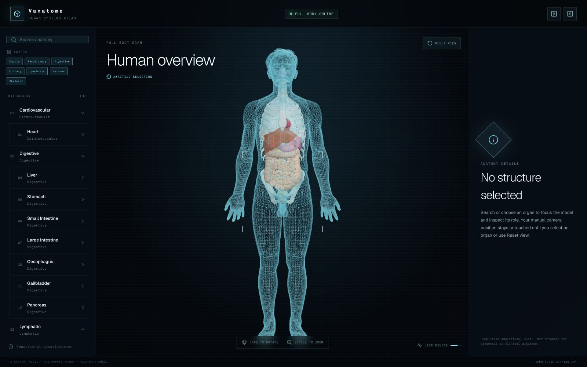
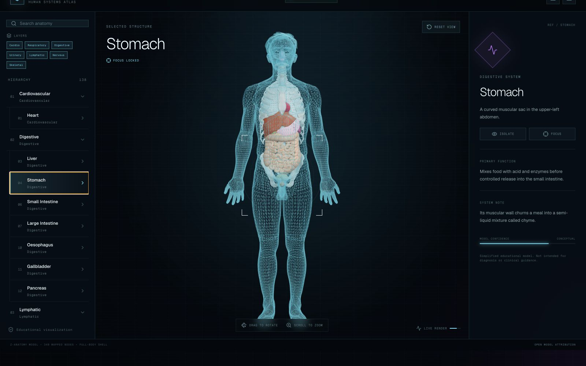
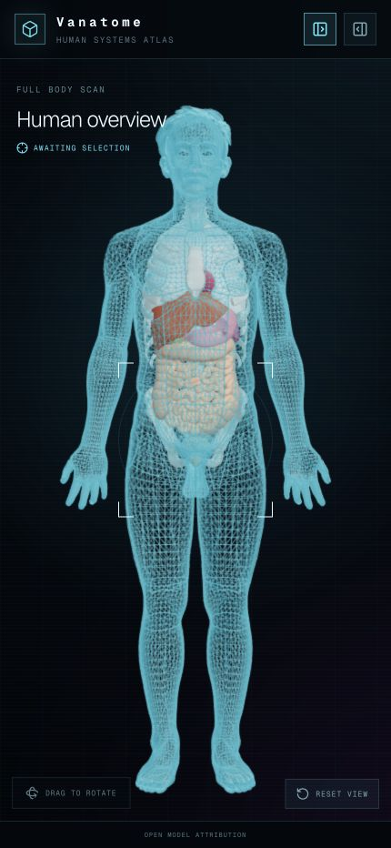

<div align="center">


# Vanatome

### Human anatomy, rendered like a hologram.

An interactive human atlas for the web—and an embeddable React viewer for
building anatomy experiences of your own.

[](https://vanatome.vixotic.in)
[](https://www.npmjs.com/package/@vixotic/vanatome-react)
[](https://www.npmjs.com/package/@vixotic/vanatome-atlas)
[](LICENSE)

</div>

<br>

<a href="https://vanatome.vixotic.in">
  
</a>

<div align="center">
  <sub>Drag it. Pick an organ. Peel the body back to what matters.</sub>
</div>

## Built from an obsession with holograms

Vanatome began with a simple fixation: a hologram should feel like something
you can reach into—not a sci-fi prop playing behind glass.

Human anatomy became the perfect canvas. The body is dense, layered, spatial,
and full of relationships that flatten badly into diagrams. Vanatome keeps
those relationships alive: the translucent shell, the structures beneath it,
the hierarchy beside it, and the details exactly where you need them.

This is not a generic 3D model viewer. It is a focused anatomy product built
around a curated, Z-Anatomy-derived human atlas.

## The body is the interface

| **See through it** | **Lock onto it** | **Strip it back** |
|:---|:---|:---|
| A translucent full-body shell keeps every structure in spatial context. | Select from the model or hierarchy, then focus the camera on the anatomy that matters. | Isolate a structure, switch system layers, and reset to the complete body at any time. |

| **Navigate the hierarchy** | **Bring your own UI** | **Stay static** |
|:---|:---|:---|
| Search 782 stable anatomy entries across eleven curated systems. | The React viewer is controlled, composable, and designed to live inside your product. | No backend, account system, analytics service, or paid platform is required. |

<table>
  <tr>
    <td width="68%">
      
    </td>
    <td width="32%">
      
    </td>
  </tr>
  <tr>
    <td align="center"><sub>Selection, focus, hierarchy, layers, and structure context.</sub></td>
    <td align="center"><sub>The full holographic view, responsive by design.</sub></td>
  </tr>
</table>

## Put Vanatome in your React app

```bash
npm install @vixotic/vanatome-react @vixotic/vanatome-atlas \
  react react-dom three @react-three/fiber @react-three/drei
```

```tsx
import { useEffect, useState } from "react";
import { createOfficialHumanAtlas } from "@vixotic/vanatome-atlas";
import {
  VanatomeViewer,
  useVanatomeController,
  type VanatomeAtlas,
} from "@vixotic/vanatome-react";

const atlasLoader = createOfficialHumanAtlas({
  catalogUrl:
    "https://atlas.vanatome.vixotic.in/releases/1.3.0/catalog.json",
});

export function Anatomy() {
  const [atlas, setAtlas] = useState<VanatomeAtlas | null>(null);
  const viewer = useVanatomeController([]);

  useEffect(() => {
    atlasLoader
      .loadProfile("full-body")
      .then(({ atlas }) => setAtlas(atlas));
  }, []);

  if (!atlas) return <p>Loading atlas…</p>;

  return (
    <div style={{ height: 640 }}>
      <VanatomeViewer
        atlas={atlas}
        selectedId={viewer.selectedId}
        isolatedId={viewer.isolatedId}
        visibleLayers={viewer.visibleLayers}
        focusRequestKey={viewer.focusRequestKey}
        resetViewKey={viewer.resetViewKey}
        onSelect={viewer.select}
      />
    </div>
  );
}
```

Distributed catalogs let `loadSystem(id)` resolve a dedicated system GLB,
while `loadProfile("full-body")` resolves the cumulative full-body bundle.
Legacy single-bundle catalogs retain their original behavior.

The package owns the 3D anatomy scene. Your app owns the surrounding
experience—search, breadcrumbs, hierarchy, sidebars, educational content, and
controls.

## Two packages. One atlas.

| Package | What it gives you |
|:---|:---|
| [`@vixotic/vanatome-react`](packages/react/README.md) | The controlled React Three Fiber viewer, interaction controller, hierarchy utilities, and TypeScript contracts. |
| [`@vixotic/vanatome-atlas`](packages/atlas/README.md) | The versioned catalog loader, stable anatomy metadata, provenance, and a viewer-ready atlas object. |

Atlas releases keep the growing GLB assets outside npm. Load the official
immutable release from `atlas.vanatome.vixotic.in`, or self-host the same
catalog, metadata, attribution, and model files on any static host.

## What ships today

```text
782  stable anatomy entries
725  geometry-mapped anatomy IDs
960  mapped GLB nodes
 11  curated anatomy systems
  0  required servers
```

- Hover, drag-safe picking, orbit, pan, zoom, bounds-based focus, isolate, and reset
- Recursive system → organ → part hierarchy
- Cardiovascular, digestive, endocrine, lymphatic, muscular, nervous,
  reproductive, respiratory, skeletal, urinary, and regional-anatomy layers
- Normal, x-ray, and ghost display modes with controlled visibility
- Selected-only, parent, and translucent-parent isolation modes
- Explicit model loading, progress, ready, error, and WebGL-loss events
- Stable public anatomy IDs for URLs, saved views, and product content
- Desktop and responsive interaction layouts
- Explicit loading, error, retry, and attribution states

## Run the product demo

```bash
git clone https://github.com/vixotic/Vanatome.git
cd Vanatome
npm install
npm run dev
```

The demo is the reference integration for both public packages. Production
loads the same public atlas endpoint available to external consumers; local
development uses the equivalent checked-in fixture.

## Go deeper

- [Atlas and asset contract](docs/atlas-contract.md)
- [Anatomy conversion and release pipeline](docs/anatomy-pipeline.md)
- [Viewer package guide](packages/react/README.md)
- [Atlas loader guide](packages/atlas/README.md)
- [Contributing](CONTRIBUTING.md)

## Open source, with explicit atlas terms

Viewer source code is available under the [MIT License](LICENSE).

The atlas is adapted from [Z-Anatomy](https://github.com/Z-Anatomy/Models) and
remains subject to
[CC BY-SA 4.0](https://creativecommons.org/licenses/by-sa/4.0/). Preserve
attribution, indicate modifications, and follow the applicable ShareAlike terms
when redistributing adapted atlas material. The upstream licenses remain
authoritative.

See [ASSET-LICENSE.md](ASSET-LICENSE.md) and the
[full attribution notice](https://atlas.vanatome.vixotic.in/ATTRIBUTION.txt)
for provenance and modification details.

---

<div align="center">

**If anatomy should feel less like a diagram and more like a presence, come
build with us.**

[Explore Vanatome](https://vanatome.vixotic.in) ·
[Install the viewer](https://www.npmjs.com/package/@vixotic/vanatome-react) ·
[Contribute](CONTRIBUTING.md)

</div>
